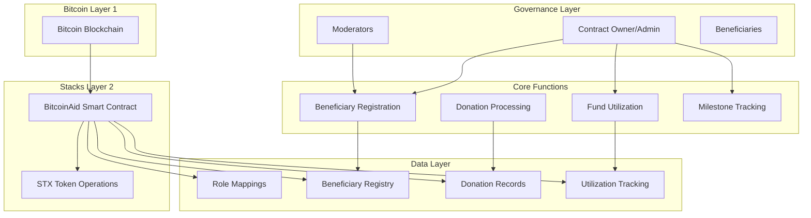

# BitcoinAid

> *Transparent Charitable Donation Platform on Bitcoin Layer 2*

[](https://stacks.co)
[](https://bitcoin.org)
[](https://clarity-lang.org)

## 🌟 Overview

BitcoinAid is a revolutionary decentralized donation management system built on Stacks Layer 2, leveraging Bitcoin's unparalleled security to create a trustless charitable giving platform. Our mission is to bring transparency, accountability, and efficiency to charitable donations through blockchain technology.

### Key Features

- 🔒 **Bitcoin-Secured**: Built on Stacks Layer 2 for Bitcoin-native security
- 🎯 **Transparent Donations**: All transactions are publicly verifiable
- 📊 **Milestone Tracking**: Fund utilization managed through milestone-based approvals
- 👥 **Role-Based Governance**: Multi-tier authorization system
- 💰 **Real-time Tracking**: Live donation amounts and utilization status
- 🏛️ **Trustless Operations**: No intermediaries, pure smart contract execution

## 🏗️ Architecture



## 🔧 System Components

### Role-Based Authorization

- **Contract Owner**: Full administrative control, role management
- **Administrators**: Fund utilization approval, milestone management
- **Moderators**: Beneficiary registration and management
- **Beneficiaries**: Registered entities eligible to receive donations

### Data Structures

- **Beneficiaries**: Name, description, funding goals, received amounts
- **Donations**: Donor information, amounts, timestamps, beneficiary mapping
- **Utilization**: Milestone-based fund usage tracking and approval workflow
- **Roles**: User permission levels and access control

## 🚀 Quick Start

### Prerequisites

- [Clarinet](https://github.com/hirosystems/clarinet) installed
- [Stacks CLI](https://docs.stacks.co/docs/stacks-cli) configured
- Basic understanding of Clarity smart contracts

### Installation

1. **Clone the repository**

```bash
git clone https://github.com/davidokusanya/bitcoin-aid.git
cd bitcoin-aid
```

2. **Initialize Clarinet project**

```bash
clarinet new bitcoinaid
cd bitcoinaid
```

3. **Add the contract**

```bash
# Copy the BitcoinAid contract to contracts/bitcoinaid.clar
cp ../bitcoinaid.clar contracts/
```

4. **Test the contract**

```bash
clarinet test
```

5. **Deploy to testnet**

```bash
clarinet deploy --testnet
```

## 📖 Usage Guide

### For Contract Owners

#### Set User Roles

```clarity
;; Assign moderator role
(contract-call? .bitcoinaid set-role 'ST1MODERATOR-ADDRESS u2)

;; Assign admin role  
(contract-call? .bitcoinaid set-role 'ST1ADMIN-ADDRESS u1)
```

### For Moderators

#### Register Beneficiaries

```clarity
(contract-call? .bitcoinaid register-beneficiary 
  u"Disaster Relief Fund" 
  u"Emergency aid for natural disaster victims in affected regions"
  u1000000) ;; Target: 10 STX
```

### For Donors

#### Make Donations

```clarity
(contract-call? .bitcoinaid donate u1 u50000) ;; Donate 0.5 STX to beneficiary #1
```

### For Administrators

#### Track Fund Utilization

```clarity
;; Add utilization milestone
(contract-call? .bitcoinaid add-utilization 
  u1 
  u"Medical supplies procurement and distribution"
  u300000) ;; 3 STX allocation

;; Approve milestone
(contract-call? .bitcoinaid approve-utilization u1 u1)
```

## 🔍 API Reference

### Public Functions

| Function | Access Level | Description |
|----------|--------------|-------------|
| `set-role` | Owner Only | Assign roles to users |
| `remove-role` | Owner Only | Remove user roles |
| `register-beneficiary` | Moderator+ | Register new beneficiaries |
| `donate` | Public | Make donations to beneficiaries |
| `add-utilization` | Admin+ | Create fund utilization milestones |
| `approve-utilization` | Admin+ | Approve milestone fund usage |

### Read-Only Functions

| Function | Description |
|----------|-------------|
| `get-beneficiary` | Retrieve beneficiary information |
| `get-donation-by-id` | Get specific donation details |
| `get-donation-count` | Total number of donations |
| `get-utilization-by-id` | Get utilization milestone details |
| `get-utilization-count` | Total utilization entries |

## 🛡️ Security Features

- **Multi-signature Operations**: Critical functions require appropriate role authorization
- **Input Validation**: Comprehensive validation of all user inputs
- **Overflow Protection**: Safe arithmetic operations throughout
- **Access Control**: Role-based permissions for sensitive operations
- **Immutable Records**: All donation and utilization records are permanently stored

## 🧪 Testing

### Run Test Suite

```bash
clarinet test
```

### Test Coverage

- ✅ Role management functionality
- ✅ Beneficiary registration and retrieval
- ✅ Donation processing and validation
- ✅ Fund utilization workflow
- ✅ Access control mechanisms
- ✅ Error handling scenarios

## 📊 Error Codes

| Code | Constant | Description |
|------|----------|-------------|
| 100 | ERR-NOT-AUTHORIZED | Insufficient permissions |
| 101 | ERR-ALREADY-REGISTERED | Entity already exists |
| 102 | ERR-NOT-FOUND | Resource not found |
| 103 | ERR-INSUFFICIENT-FUNDS | Inadequate balance |
| 104 | ERR-BENEFICIARY-NOT-FOUND | Invalid beneficiary ID |
| 105 | ERR-UTILIZATION-NOT-FOUND | Invalid utilization entry |
| 106 | ERR-INVALID-INPUT | Invalid input parameters |

## 🤝 Contributing

We welcome contributions from the community! Please follow these steps:

1. Fork the repository
2. Create a feature branch (`git checkout -b feature/amazing-feature`)
3. Commit your changes (`git commit -m 'Add amazing feature'`)
4. Push to the branch (`git push origin feature/amazing-feature`)
5. Open a Pull Request

### Development Guidelines

- Write comprehensive tests for new features
- Follow Clarity best practices
- Document all public functions
- Maintain backwards compatibility

## 🚦 Roadmap

### Phase 1 (Current)

- [x] Core donation functionality
- [x] Role-based access control
- [x] Milestone-based fund tracking
- [x] Basic beneficiary management

### Phase 2

- [ ] Web interface integration
- [ ] Advanced reporting features
- [ ] Multi-token support
- [ ] Automated milestone triggers

### Phase 3

- [ ] Cross-chain integration
- [ ] Mobile application
- [ ] Advanced analytics dashboard
- [ ] Community governance features

## 🙏 Acknowledgments

- Built with ❤️ on [Stacks](https://stacks.co)
- Secured by [Bitcoin](https://bitcoin.org)
- Powered by [Clarity](https://clarity-lang.org)
